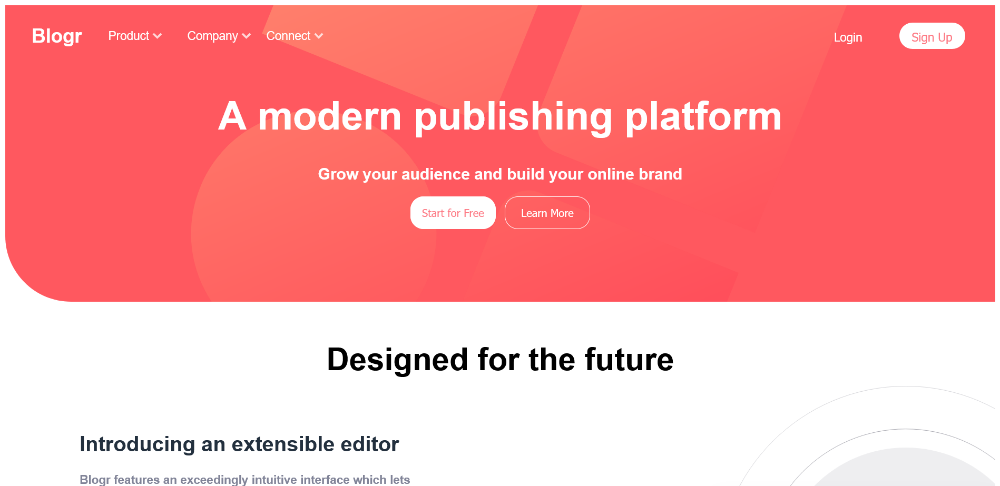

# Blogger landing page (PSD to HTML)

This is a solution to the [Blogr landing page challenge on Frontend Mentor](https://www.frontendmentor.io/challenges/blogr-landing-page-EX2RLAApP).

Live Site Link: https://cwebdev.github.io/Blogger-Landing-Page/
## Table of contents

- [Overview](#overview)
  - [Description](#description)
  - [Screenshot](#screenshot)
  - [Links](#links)
- [My process](#my-process)
  - [Built with](#built-with)  
- [Author](#author)

## Overview

A blogger landing page (responsive website) developed using HTML, CSS and JavaScript.

### Description

This landing page is developed in HTML5, CSS3 and JavaScript from PSD design. Page is responsive in web and mobile screens. Site performs very well in Google lighthouse performance metrics.

### Desktop Screenshot

#### Mobile Screenshot

### Links

## My process

### Built with

- Semantic HTML5 markup
- CSS Flexbox
- Mobile-first workflow

## Author

- Website - [Chitrang Shah](https://chitrang.webflow.io/)
- Frontend Mentor Profile - [@cwebdev](https://www.frontendmentor.io/profile/cwebdev)
